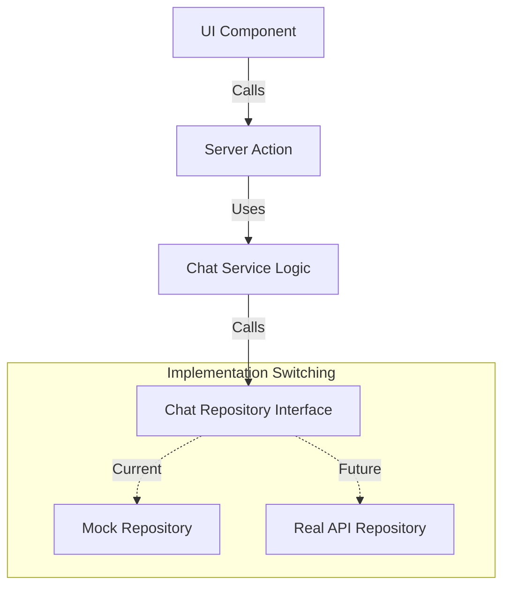

# AI Chat & Backend Integration Plan (Architecture First)

이 문서는 **"백엔드 구현 시 코드 수정 없이 즉시 연동"**을 최우선 목표로 합니다.
이를 위해 **Dependency Injection(의존성 주입)** 개념과 유사한 **Service Layer Pattern**을 도입하여, 비즈니스 로직과 데이터 페칭 로직을 완벽하게 분리합니다.

## 1. 핵심 아키텍처 (Core Architecture)

프론트엔드가 백엔드의 구현 여부에 영향받지 않도록 **추상화 계층(Abstraction Layer)**을 둡니다.



*   **UI & Server Action**: "메시지를 보낸다"는 행위만 관여하며, 실제 데이터가 어디서 오는지(Mock인지 API인지) 관여하지 않습니다.
*   **Chat Repository Interface**: `sendMessage`, `getHistory` 등 표준화된 함수 스펙을 정의합니다.
*   **Switching**: 환경 변수(`USE_MOCK_API`) 하나로 Mock 모드와 Real 모드를 전환합니다.

---

## 2. 인터페이스 정의 (일종의 계약, Contract)

백엔드 개발자와 합의해야 할(혹은 프론트가 정의하고 백엔드가 따라야 할) 데이터 규격입니다.

### 2.1. 도메인 모델 (Types)
```typescript
// apps/web/domain/chat/types.ts
export type MessageRole = 'user' | 'assistant' | 'system';

export interface ChatMessage {
  id: string;
  role: MessageRole;
  content: string;
  timestamp: Date;
}
```

### 2.2. 레포지토리 인터페이스 (Interface)
```typescript
// apps/web/domain/chat/repository.interface.ts
export interface IChatRepository {
  sendMessage(message: string, history: ChatMessage[]): Promise<ChatMessage>;
  // 추후 스트리밍 필요 시: sendMessageStream(...) 추가
}
```

---

## 3. 구현 계획 (Implementation Steps)

### Phase 1: 구조 설계 및 Mock 구현 (Current)

**목표**: `MockChatRepository`를 만들어 실제 백엔드처럼 동작하게 하고, `Server Action`은 인터페이스만 바라보게 합니다.

1.  **Repository Layer 생성**:
    *   `apps/web/services/chat/chat.repository.mock.ts`: 더미 데이터와 딜레이, 로직이 포함된 가짜 구현체.
    *   **Mock 특징**:
        *   `setTimeout`으로 네트워크 딜레이 시물레이션 (Latecy).
        *   키워드 분석("매출", "추천") 로직 내장.
2.  **Service/Factory 구성**:
    *   `apps/web/services/chat/chat.service.ts`: 현재 환경(Env)에 따라 Mock 또는 Real Repository를 리턴하는 팩토리 함수 구현.
3.  **Server Action 연결**:
    *   `actions/chat.ts`는 구체적인 구현 내용을 모두 지우고, `ChatService.sendMessage()`만 호출하도록 수정.

### Phase 2: 백엔드 연동 (Future)

**목표**: **기존 코드를 건드리지 않고**, 새로운 파일 하나만 추가하여 연동을 완료합니다.

1.  **Real Repository 생성**:
    *   `apps/web/services/chat/chat.repository.api.ts` 파일 생성.
    *   `fetch`를 사용하여 실제 백엔드 엔드포인트(`POST /api/chats`) 호출.
2.  **환경 변수 변경**:
    *   `.env` 파일에서 `USE_MOCK_API=false` 로 변경.
    *   Service Factory가 자동으로 `RealChatRepository`를 주입하므로 연동 끝.

---

## 4. 디렉토리 구조 제안 (Suggested Structure)

```
apps/web/
├── actions/
│   └── chat.ts                # (수정 예정) Service 호출로 단순화
├── services/
│   └── chat/
│       ├── types.ts             # 데이터 타입 정의
│       ├── chat.interface.ts    # 인터페이스 정의
│       ├── chat.mock.ts         # Phase 1: Mock 구현체 (더미데이터 O)
│       └── chat.api.ts          # Phase 2: 실제 API 구현체 (fetch O)
└── ...
```

---

## 5. Mocking 상세 전략 (For Phase 1)

`MockChatRepository`에 들어갈 구체적인 로직입니다.

```typescript
// chat.mock.ts 예시
export class MockChatRepository implements IChatRepository {
  async sendMessage(message: string): Promise<ChatMessage> {
    // 1. Network Latency Simulation
    await new Promise(resolve => setTimeout(resolve, 1200));

    // 2. Business Logic Simulation
    let content = "무엇을 도와드릴까요?";
    if (message.includes("매출")) {
      content = "이번 달 매출은 **3,500만원**입니다. 📈";
    }

    return {
      id: Date.now().toString(),
      role: 'assistant',
      content,
      timestamp: new Date(),
    };
  }
}
```

---

## 6. Action Plan (TODO)

### ✅ Setup Architecture (아키텍처 수립)
- [ ] `services/chat` 디렉토리 생성.
- [ ] `types.ts` 및 `chat.interface.ts` 정의.

### 🛠 Implement Mock (더미 동작 구현)
- [ ] `chat.mock.ts` 구현:
    - [ ] `setTimeout`으로 비동기 딜레이 적용.
    - [ ] 키워드("매출", "메뉴" 등)에 따른 분기 처리 리얼하게 구현.
- [ ] `actions/chat.ts` 리팩토링: 직접 로직을 제거하고 `ChatService` 호출로 변경.

### 🌐 Future Integration (백엔드 연동)
- [ ] `chat.api.ts` 구현 (`fetch` 로직).
- [ ] 환경 변수 스위칭 적용.
